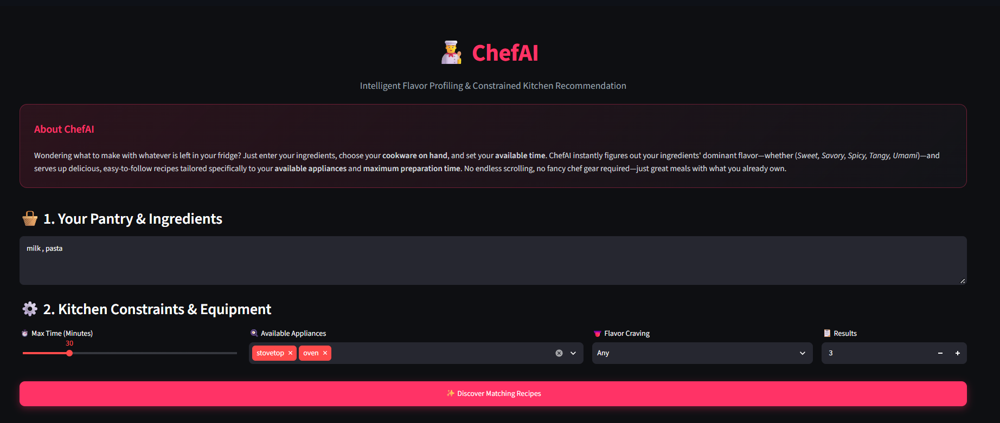
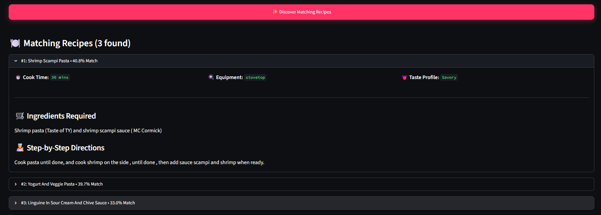

#  ChefAI — Smart Kitchen Recommender & Flavor Profiler

ChefAI is an intelligent, end-to-end culinary recommendation system. It extracts the dominant taste profile (*Sweet, Savory, Spicy, Tangy, Umami*) directly from available pantry ingredients using a neural network classifier and recommends matching recipes strictly constrained by your **available appliances** and **cooking time limit**.

Demo Link : https://chefai-shazar.streamlit.app/





---

##  Key Features

- **Neural Flavor Profiling:** Predicts flavor profiles and class probability breakdowns from raw ingredient inputs using an `MLPClassifier` trained on TF-IDF ingredient vector representations.
- **Hardware-Constrained Matching:** Hard-filters recipes to ensure required tools (e.g., *stovetop, oven, microwave, blender, slow cooker*) are available to the user.
- **Time-Constrained Recommendations:** Enforces strict cooking time caps based on your schedule.
- **Vectorized Ranking:** Scores candidate recipes using Cosine Similarity against a precomputed sparse matrix representation of recipe ingredients.
- **Interactive UI:** Built with Streamlit featuring a clean, responsive single-page layout.

---

##  Architecture & Project Structure

```text
chef-ai/
│
├── data/
│   ├── artifacts/                      # Serialized models and database snapshots
│   │   ├── label_encoder.pkl          # Target class decoder
│   │   ├── recipes_processed.parquet  # Processed recipe catalog
│   │   ├── taste_dl_model.pkl         # Trained MLP neural classifier
│   │   ├── tfidf_recommender.pkl      # Fitted Scikit-Learn vectorizer
│   │   └── tfidf_matrix.pkl           # Precomputed TF-IDF sparse matrix
│   ├── modelwork.ipynb                # Data cleaning & model training notebook
│   └── RecipeNLG_dataset.csv          # Raw dataset (excluded via .gitignore)
│
├── src/
│   ├── __init__.py                    # Package initialization
│   ├── loader.py                      # Robust artifact and matrix loader
│   ├── classifier.py                  # Taste inference logic
│   ├── filter.py                      # Hardware & duration constraint engine
│   └── recommender.py                 # Cosine similarity ranking engine
│
├── app.py                             # Streamlit web user interface
├── main.py                            # Core pipeline orchestrator
├── requirements.txt                   # Production dependencies
├── .gitignore                         # Version control exclusions
└── README.md                          # Project documentation